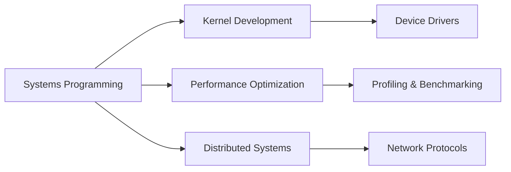

<div align="center">

# EA David

### Systems Programmer | Low-Level Architecture | Performance Engineering

[](https://github.com/eadavid)
[](https://linkedin.com/in/eadavid)
[](mailto:your.email@example.com)

</div>

---

## 👨‍💻 About Me

Systems programmer specializing in low-level software development, performance optimization, and system architecture. Passionate about building efficient, reliable systems that operate close to the metal.

```c
typedef struct {
    char *name;
    char *role;
    char *focus[3];
} Developer;

Developer me = {
    .name = "EA David",
    .role = "Systems Programmer",
    .focus = {"Performance", "Reliability", "Elegance"}
};
```

---

## 🛠️ Technology Stack

**Systems & Low-Level**
- C/C++ • Rust • Assembly (x86/ARM)
- Linux Kernel • POSIX • System Calls
- Memory Management • Concurrency • IPC

**Tools & Infrastructure**
- GDB • Valgrind • perf • strace
- Git • Make • CMake • Docker
- CI/CD • Performance Profiling

**Areas of Expertise**
- Operating Systems & Kernel Development
- High-Performance Computing
- Network Programming & Protocols
- Embedded Systems & Real-Time Computing

---

## 📊 GitHub Statistics

<div align="center">


</div>

---

## 📈 Contribution Activity

<div align="center">


</div>

---

## 🏆 GitHub Trophies

<div align="center">


</div>

---

## 💻 Code Time & Productivity

<div align="center">


</div>

---

## 🔥 Featured Projects

### 🚀 High-Performance Systems

| Project | Description | Tech Stack | Stars |
|---------|-------------|------------|-------|
| **[project-name-1]** | High-performance network stack | C, Linux, TCP/IP |  |
| **[project-name-2]** | Custom memory allocator | C, Assembly |  |
| **[project-name-3]** | Real-time scheduler | C++, RTOS |  |

---

## 📚 Latest Blog Posts

<!-- BLOG-POST-LIST:START -->
- Coming soon: Technical deep-dives on systems programming
<!-- BLOG-POST-LIST:END -->

---

## 🎯 Current Focus



- 🔭 Working on: High-performance distributed systems
- 🌱 Learning: Rust for systems programming, eBPF
- 📖 Reading: "Operating Systems: Three Easy Pieces"
- 💡 Exploring: RISC-V architecture and custom hardware

---

## 📫 Get In Touch

<div align="center">

[](https://github.com/eadavid)
[](https://linkedin.com/in/eadavid)
[](mailto:your.email@example.com)
[](https://twitter.com/eadavid)

</div>

---

## ⚡ Quick Facts

- 💼 Open to collaboration on systems-level projects
- 🎓 Strong believer in clean, documented code
- 🔧 Contributor to open-source systems projects
- ⚙️ Performance enthusiast: "Every cycle counts"

---

<div align="center">

### "Talk is cheap. Show me the code." - Linus Torvalds


**⭐ From [EA David](https://github.com/eadavid)**

</div>
