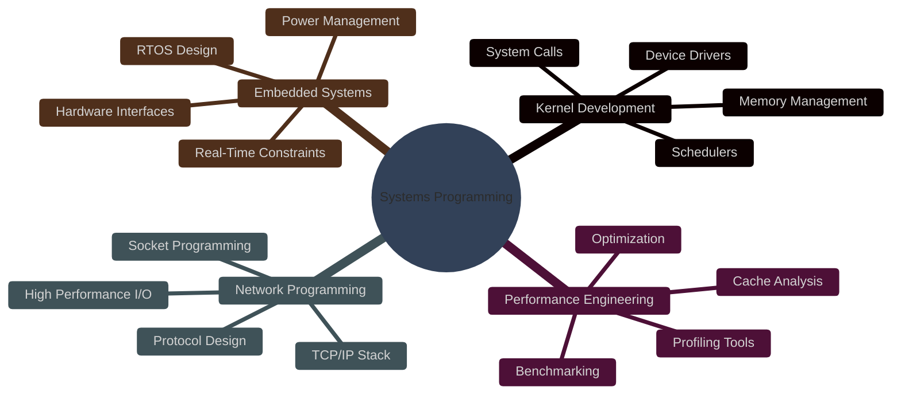

<div align="center">

<!-- HERO SECTION -->


<h2 style="font-family: 'JetBrains Mono', monospace;">
  <code>Systems Programmer | Performance Engineer | Low-Level Architect</code>
</h2>

<br>

[](https://git.io/typing-svg)

<br>

<!-- BADGES -->
<p>
  <a href="https://github.com/eadavid"></a>
  <a href="https://linkedin.com/in/eadavid"></a>
  <a href="mailto:your.email@example.com"></a>
  
</p>

</div>

<br><br>

<!-- SOLID STATS SECTION -->
<div align="center">

## 📊 **PERFORMANCE DASHBOARD**

<br>

<table>
  <tr>
    <td align="center" width="25%">
      
      <br><br>
      
      <br>
      <sub><b>Total Commits</b></sub>
    </td>
    <td align="center" width="25%">
      
      <br><br>
      
      <br>
      <sub><b>Public Repositories</b></sub>
    </td>
    <td align="center" width="25%">
      
      <br><br>
      
      <br>
      <sub><b>Total Stars</b></sub>
    </td>
    <td align="center" width="25%">
      
      <br><br>
      
      <br>
      <sub><b>Contributions (2026)</b></sub>
    </td>
  </tr>
</table>

<br>

<!-- LIVE STATS -->
<table>
  <tr>
    <td width="50%" align="center">
      
    </td>
    <td width="50%" align="center">
      
    </td>
  </tr>
</table>

<br>


<br>


</div>

<br><br>

<!-- ABOUT ME SECTION -->
<div align="center">

## 💻 **ABOUT ME**

</div>

<div align="center">

<table>
  <tr>
    <td width="50%" valign="top">
      
**🎯 SPECIALIZATION**

```yaml
role: Systems Programmer
focus:
  - Low-Level Programming
  - Performance Engineering
  - Kernel Development
  - Real-Time Systems
  
languages:
  primary: [C, C++, Rust]
  secondary: [Assembly, Python]
  
expertise:
  - Memory Management
  - Concurrency & Threading
  - System Calls & IPC
  - Hardware Interaction
```

</td>
<td width="50%" valign="top">

**⚡ PHILOSOPHY**

```c
typedef struct {
    char *principle;
    int priority;
} DevelopmentRule;

DevelopmentRule rules[] = {
    {"Write clean, readable code", 10},
    {"Optimize only what matters", 9},
    {"Test thoroughly", 9},
    {"Document everything", 8},
    {"Performance is a feature", 10}
};

// "Premature optimization is the root 
//  of all evil, but we optimize anyway"
```

</td>
</tr>
</table>

</div>

<br><br>

<!-- TECHNICAL SKILLS SECTION -->
<div align="center">

## 🛠️ **TECHNICAL ARSENAL**

<br>

**PROGRAMMING LANGUAGES**

<p>
  
  
  
  
  
  
</p>

**SYSTEMS & PLATFORMS**

<p>
  
  
  
  
  
</p>

**DEVELOPMENT TOOLS**

<p>
  
  
  
  
  
  
</p>

</div>

<br><br>

<!-- DETAILED METRICS SECTION -->
<div align="center">

## 📈 **DETAILED ANALYTICS**

<br>

<table>
  <tr>
    <td width="50%" align="center">
      
    </td>
    <td width="50%" align="center">
      
    </td>
  </tr>
  <tr>
    <td width="50%" align="center">
      
    </td>
    <td width="50%" align="center">
      
    </td>
  </tr>
</table>

<br>


</div>

<br><br>

<!-- FEATURED PROJECTS SECTION -->
<div align="center">

## 🚀 **FEATURED PROJECTS**

<br>

<table>
  <tr>
    <td width="50%" align="center">
      <a href="https://github.com/eadavid/high-performance-allocator">
        
      </a>
    </td>
    <td width="50%" align="center">
      <a href="https://github.com/eadavid/kernel-module-dev">
        
      </a>
    </td>
  </tr>
  <tr>
    <td width="50%" align="center">
      <a href="https://github.com/eadavid/network-stack">
        
      </a>
    </td>
    <td width="50%" align="center">
      <a href="https://github.com/eadavid/embedded-rtos">
        
      </a>
    </td>
  </tr>
</table>

</div>

<br><br>

<!-- ACHIEVEMENTS SECTION -->
<div align="center">

## 🏆 **ACHIEVEMENTS & MILESTONES**

<br>


</div>

<br><br>

<!-- CURRENT FOCUS SECTION -->
<div align="center">

## 🎯 **CURRENT FOCUS**

<br>

<table>
  <tr>
    <td width="50%" valign="top">

**🔴 ACTIVE PROJECTS**

```javascript
const projects = {
  kernel_dev: {
    status: "In Progress",
    progress: "60%",
    focus: "Device Drivers"
  },
  performance_tools: {
    status: "Active",
    progress: "75%",
    focus: "Profiling Framework"
  },
  network_stack: {
    status: "Planning",
    progress: "30%",
    focus: "TCP/IP Optimization"
  },
  embedded_rtos: {
    status: "Maintenance",
    progress: "85%",
    focus: "Real-Time Scheduler"
  }
};
```

</td>
<td width="50%" valign="top">

**🌱 LEARNING PATH**

```rust
struct LearningGoals {
    current: Vec<&'static str>,
    next: Vec<&'static str>,
}

let goals = LearningGoals {
    current: vec![
        "eBPF & Extended BPF",
        "Rust for Systems",
        "RISC-V Architecture",
        "Advanced Compilers"
    ],
    next: vec![
        "Formal Verification",
        "Hardware Security",
        "Distributed Systems"
    ]
};
```

</td>
</tr>
</table>

<br>



</div>

<br><br>

<!-- CONTRIBUTION ACTIVITY SECTION -->
<div align="center">

## 📊 **CONTRIBUTION ACTIVITY**

<br>


<br><br>

<table>
  <tr>
    <td align="center">
      
    </td>
    <td align="center">
      
    </td>
    <td align="center">
      
    </td>
  </tr>
</table>

</div>

<br><br>

<!-- CONTACT SECTION -->
<div align="center">

## 📬 **GET IN TOUCH**

<br>

<table>
  <tr>
    <td align="center" width="25%">
      <a href="https://github.com/eadavid">
        
        <br><br>
        
      </a>
    </td>
    <td align="center" width="25%">
      <a href="https://linkedin.com/in/eadavid">
        
        <br><br>
        
      </a>
    </td>
    <td align="center" width="25%">
      <a href="mailto:your.email@example.com">
        
        <br><br>
        
      </a>
    </td>
    <td align="center" width="25%">
      <a href="https://twitter.com/eadavid">
        
        <br><br>
        
      </a>
    </td>
  </tr>
</table>

<br>

**💡 Open to Collaboration**

*Interested in systems programming, kernel development, performance optimization, and embedded systems.*

*Available for consulting, contract work, and full-time opportunities.*

</div>

<br><br>

<!-- FOOTER SECTION -->
<div align="center">

---

<br>

### ⚡ *"Talk is cheap. Show me the code."* — Linus Torvalds

<br>


**© 2026 EA David • Crafted with precision and performance in mind**

<sub>Built with JetBrains Mono • Powered by GitHub • Optimized for speed</sub>

</div>
