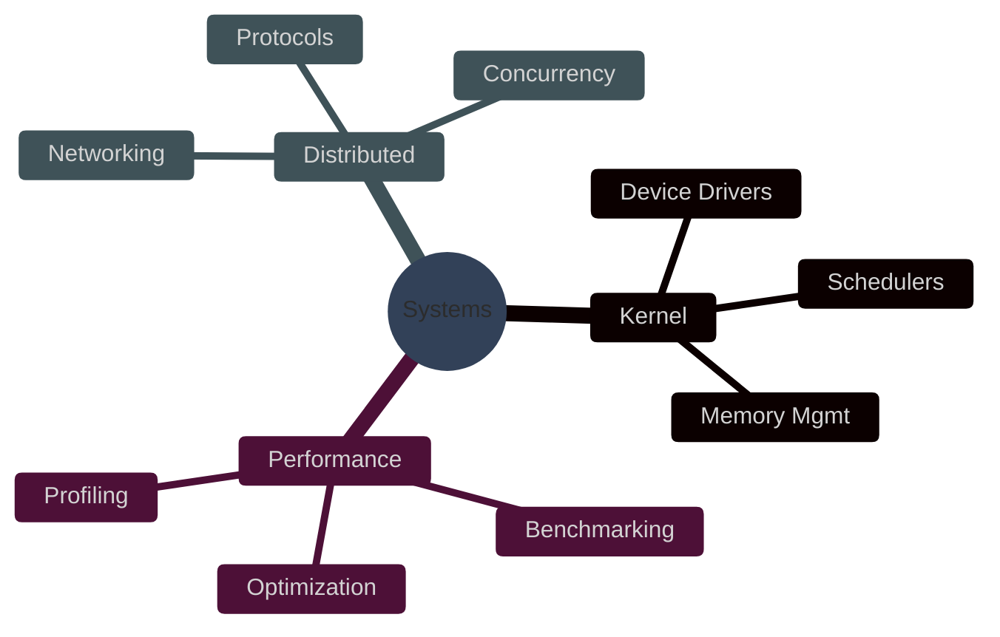

### Systems Programmer | Performance Engineer | Low-Level Architect

 

---

## 🎯 Professional Overview

<table>
<tr>
<td width="60%" valign="top">

### Core Competencies
- **Systems Programming**: C/C++, Rust, Assembly (x86/ARM)
- **Operating Systems**: Linux Kernel, POSIX, Real-Time Systems
- **Performance**: Profiling, Optimization, Memory Management
- **Concurrency**: Multi-threading, IPC, Synchronization
- **Tools**: GDB, Valgrind, perf, strace, CMake

</td>
<td width="40%" valign="top">

### Quick Stats

</td>
</tr>
</table>

 

---

## 📊 GitHub Analytics

<table>
<tr>
<td width="50%">

### Performance Metrics

</td>
<td width="50%">

### Language Distribution

</td>
</tr>
</table>

### Contribution Timeline

### Activity Graph

 

---

## 📈 Detailed Metrics

<table>
<tr>
<td width="50%">

</td>
<td width="50%">

</td>
</tr>
<tr>
<td width="50%">

</td>
<td width="50%">

</td>
</tr>
</table>

### Commit Distribution Over Time

 

---

## 🚀 Featured Projects

<table>
<tr>
<td width="50%">

</td>
<td width="50%">

</td>
</tr>
<tr>
<td width="50%">

</td>
<td width="50%">

</td>
</tr>
</table>

 

---

## 🏆 Achievements & Recognition

 

---

## 💼 Technical Arsenal

### Programming Languages

### Systems & Platforms

### Development Tools

 

---

## 📊 Contribution Activity

### Recent Contributions

<table>
<tr>
<td align="center">

**Total Commits**

</td>
<td align="center">

**Public Repositories**

</td>
<td align="center">

**Years on GitHub**

</td>
</tr>
</table>

### Contribution Snake

 

---

## 🎓 Current Focus

<table>
<tr>
<td width="50%">

</td>
<td width="50%">

### Active Projects
- 🔴 **Kernel Development** - Device drivers & modules
- 🟢 **Performance Tools** - Profiling framework
- 🟡 **Network Stack** - High-performance TCP/IP
- 🔵 **RTOS** - Real-time embedded systems

### Learning Path
- eBPF & Extended Berkeley Packet Filter
- Rust for systems programming
- RISC-V architecture
- Advanced compiler optimizations

</td>
</tr>
</table>

 

---

## 📬 Get In Touch

<table>
<tr>
<td align="center" width="25%">

**GitHub**

</td>
<td align="center" width="25%">

**LinkedIn**

</td>
<td align="center" width="25%">

**Email**

</td>
<td align="center" width="25%">

**Twitter**

</td>
</tr>
</table>

 

### 💡 Open to Collaboration

**Interested in:** Systems programming projects, kernel development, performance optimization, embedded systems, and open-source contributions.

**Available for:** Consulting, contract work, full-time opportunities.

 

---

### ⚡ "Premature optimization is the root of all evil" - Donald Knuth

**But we optimize anyway. 🚀**

 

**© 2026 EA David | Built with ❤️ and systems-level precision**

