<div align="center">

# 🔷 EA DAVID
**SYSTEMS PROGRAMMER** • **PERFORMANCE ENGINEER** • **LOW-LEVEL ARCHITECT**

[](https://github.com/eadavid)
[](https://github.com/eadavid)

</div>

---

## 📊 SYSTEM METRICS DASHBOARD

<div align="center">

### ⚡ CORE PERFORMANCE INDICATORS

<table>
<tr>
<td width="50%">

**ACTIVITY MATRIX**


</td>
<td width="50%">

**LANGUAGE DISTRIBUTION**


</td>
</tr>
</table>

### 🔥 CONTRIBUTION HEATMAP


### 📈 COMMIT ACTIVITY GRAPH


</div>

---

## 🎯 PROJECT ANALYTICS

<div align="center">

### 📦 REPOSITORY METRICS


### 🔧 COMMIT DISTRIBUTION


</div>

---

## 🏆 ACHIEVEMENT MATRIX

<div align="center">


</div>

---

## 💻 LIVE CODE METRICS

<div align="center">

<table>
<tr>
<td align="center" width="33%">

**TOTAL COMMITS**


</td>
<td align="center" width="33%">

**REPOSITORIES**


</td>
<td align="center" width="33%">

**CONTRIBUTIONS (YTD)**


</td>
</tr>
</table>

### 📊 LANGUAGE PROFICIENCY RADAR

```mermaid
%%{init: {'theme':'dark'}}%%
graph TB
    subgraph CORE["⚡ CORE SYSTEMS"]
        C[C/C++]
        ASM[Assembly]
        RUST[Rust]
    end
    subgraph TOOLS["🔧 TOOLCHAIN"]
        GDB[GDB]
        PERF[perf]
        MAKE[Make/CMake]
    end
    subgraph PLATFORM["💾 PLATFORM"]
        LINUX[Linux Kernel]
        POSIX[POSIX APIs]
        RT[Real-Time]
    end
    
    C --> LINUX
    ASM --> RT
    RUST --> POSIX
    GDB --> C
    PERF --> LINUX
    MAKE --> C
    
    style CORE fill:#003300,stroke:#00ff00,stroke-width:2px
    style TOOLS fill:#003300,stroke:#00ff00,stroke-width:2px
    style PLATFORM fill:#003300,stroke:#00ff00,stroke-width:2px
    style C fill:#00ff00,stroke:#00ff00,color:#000000
    style ASM fill:#00ff00,stroke:#00ff00,color:#000000
    style RUST fill:#00ff00,stroke:#00ff00,color:#000000
```



</div>

---

## 🚀 FEATURED REPOSITORIES

<div align="center">

[](https://github.com/eadavid/project-1)
[](https://github.com/eadavid/project-2)

[](https://github.com/eadavid/project-3)
[](https://github.com/eadavid/project-4)

</div>

---

## 📡 SYSTEM STATUS

<div align="center">

```ascii
╔══════════════════════════════════════════════════════════════╗
║                    DEVELOPMENT PIPELINE                      ║
╠══════════════════════════════════════════════════════════════╣
║  🔴 KERNEL DEVELOPMENT        ████████████░░░░░░░░  60%     ║
║  🟢 PERFORMANCE OPTIMIZATION  ████████████████████  100%    ║
║  🟡 DISTRIBUTED SYSTEMS       ████████░░░░░░░░░░░░  40%     ║
║  🔵 EMBEDDED SYSTEMS          ████████████████░░░░  80%     ║
╚══════════════════════════════════════════════════════════════╝
```

### 🌐 NETWORK

[](https://github.com/eadavid)
[](https://linkedin.com/in/eadavid)
[](mailto:your.email@example.com)

### 📊 CONTRIBUTION SNAKE


</div>

---

<div align="center">

**🔐 SECURE • 🚀 OPTIMIZED • 💡 INNOVATIVE**


</div>
